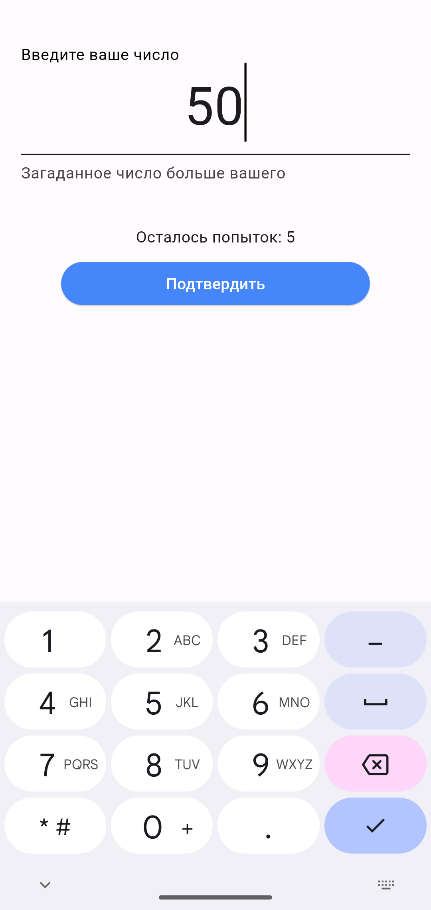

# 🕹️ Угадай Число (Guess the Number)

Интерактивная игра "Угадай число", где система загадывает случайное число в указанном диапазоне, а у игрока есть ограниченное количество попыток, чтобы его угадать.

---

## 📖 Описание

"Угадай число" — это простая, но увлекательная игра, где:
- Пользователь может настроить диапазон чисел и количество попыток.
- Получает подсказки (больше/меньше) после каждой попытки.
- Побеждает, угадывая число, или проигрывает, если попытки закончились.

## 🖼️ Скриншоты

### Главный экран


### Игра в процессе


### Игра в процессе


### Экран победы


### Экран поражения


---

## Запуск приложения
```shell script
# Скачайте проект в свой локальный репозитории
git clone https://github.com/ulkhnv/guess_the_number.git

# Установите зависимости
flutter pub get

# Настройте эмулятор Android/iOS или подключите физическое устройство. Затем запустите приложение
flutter run
```
